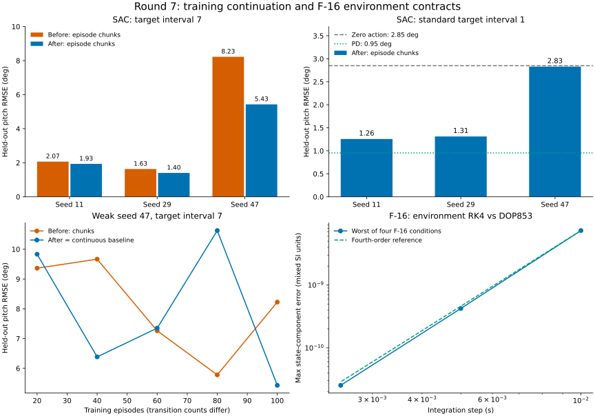

# Седьмой проход: продолжение SAC и контракт среды F-16

Дата: 17 сентября 2026. Сравнение — с незакоммиченным состоянием после шестого
прохода, сохранённым в `/tmp/physics-policy-audit-round7/before`.
Предыдущие исправления сохранены. Новые изменения не закоммичены.

## Результат

- Исправлены сброс расписания обновлений SAC между вызовами, потеря настроек
  политики при сохранении и некорректная лучшая награда без сохранения checkpoint.
- У F-16 исправлены начальные наблюдения с высотой, приём полного состояния
  балансировки, диапазон тяги и отсутствие тяги в истории управления.
- **2811 тестов проходят**, покрытие **20881 / 22471 = 92,92%**. Добавлено 36
  тестовых случаев; на предыдущей версии 33 из них падают, 3 уже проходили.
- Проведено **15 новых обучений SAC**. Исправленное обучение частями точно
  воспроизводит непрерывное обучение на всех трёх seed при обоих проверенных
  интервалах обновления целевой сети.
- В стандартном режиме средняя ошибка тангажа **1,7988°**, нарушений границ
  **0/72**. Численной расходимости не обнаружено; слабые политики остаются.

Числа, кривые, хеши весов и исходников: [JSON](physics-policy-validation-round7.json).

## Исправления SAC

1. `train()` и `train_vector()` обнуляли индекс градиентного обновления на каждом
   вызове. При `target_update_interval > 1` это меняло расписание сглаживания
   целевой сети. Теперь общие `total_updates` и `total_env_steps` сохраняются;
   шаги метрик также продолжаются. Прямые вызовы `update_parameters()` по-прежнему
   получают индекс от вызывающего кода.
2. `train(save_best=False)` возвращал `best_reward=-inf` даже после успешных
   эпизодов. Максимум теперь вычисляется независимо от записи checkpoint.
   Возвращаемые `updates` и награда относятся к текущему вызову.
3. В конфигурации checkpoint отсутствовал `policy_lr`: загрузка без состояний
   оптимизаторов подставляла стандартную скорость. Теперь сохраняются текущие
   скорости критика и политики, частота логирования и счётчики. Старый формат
   без счётчиков поддерживается.
4. Deterministic-политика игнорировала явно переданный `policy_lr` и использовала
   `lr` критика. Исправлено; поведение обоих типов политики согласовано.

Правило мягкого обновления целевых сетей соответствует
[описанию SAC в Spinning Up](https://spinningup.openai.com/en/latest/algorithms/sac.html).
Исправление сохраняет фазу существующего расписания; коэффициент `tau` и уравнения
оптимизации не менялись.

Checkpoint **не содержит replay buffer, состояния среды и RNG**. Сохранение
счётчиков не означает побитное продолжение после перезапуска процесса.
`train_vector()` при каждом вызове сбрасывает среду и заново применяет переданный
`warmup_steps`; тест эквивалентности разбивает обучение на границах эпизодов с
нулевым прогревом. Произвольное разбиение посреди эпизода не обещается.

## Проверка качества SAC

Одна и та же зафиксированная среда B747, seed **11, 29, 47**, CPU, сети 64×64,
batch=128, replay=50000, LR=0,0003, gamma=0,99, tau=0,005, alpha=0,01,
автонастройка энтропии выключена. Обучение — **100 эпизодов на запуск**.

Оценка каждые 20 эпизодов сохраняет и восстанавливает RNG обучения. Финальные
веса оцениваются на 24 одинаковых сценариях: ступени ±2°/±4°, время включения
0,5–1,5 с, горизонт 10 с, шаг 0,05 с. Нарушение — выход тангажа за ±20°.
Ни лучший checkpoint, ни лучший seed не отбираются.

### Интервал обновления целевой сети 7: воспроизведение дефекта

| Seed | До: обучение частями, RMSE | После: частями, RMSE | Нарушения до → после | Шаги среды до → после |
|---|---:|---:|---:|---:|
| 11 | 2,0671° | 1,9331° | 0 → 0 | 19792 → 19792 |
| 29 | 1,6311° | 1,4030° | 0 → 0 | 19754 → 19754 |
| 47 | 8,2254° | 5,4300° | 24 → 0 | 7266 → 13041 |
| Среднее / всего | **3,9745°** | **2,9220°** | **24/72 → 0/72** | |

Проверены три режима для каждого seed: старое непрерывное обучение, старое
обучение по одному эпизоду и исправленное обучение по одному эпизоду.
**Веса policy, critic и critic_target исправленных запусков побитно совпадают
со старым непрерывным обучением**; совпадают кривые, число обновлений и оценки.
Это непосредственно подтверждает устранение ошибки разбиения.

Бюджет задан эпизодами. У seed 47 старые частичные вызовы чаще завершаются
аварийно, поэтому дают меньше переходов. Таблица не является сравнением качества
при одинаковом числе переходов; причинный контроль здесь — точное совпадение
исправленного варианта с непрерывным baseline при одинаковых шагах и RNG.

### Стандартный интервал 1: проверка отсутствия регрессии

Дополнительно выполнены шесть запусков: три старых непрерывных и три исправленных
частичных. В каждой паре все три сети, кривые и оценки **точно совпадают**.

| Seed | RMSE до = после | Нарушения после | Шаги среды |
|---|---:|---:|---:|
| 11 | 1,2563° | 0/24 | 19662 |
| 29 | 1,3111° | 0/24 | 19808 |
| 47 | 2,8291° | 0/24 | 13824 |
| Среднее / всего | **1,7988°** | **0/72** | |

Все потери каждого обновления и конечные веса конечны. Но PD на этих же сценариях
даёт **0,9538°**, нулевое управление — **2,8493°**. Seed 47 стандартного режима
едва лучше нулевого управления; при интервале 7 он существенно хуже. Промежуточные
оценки немонотонны. Отсутствие NaN и финальных нарушений **не доказывает сходимость
или достаточное качество всех политик**. Настройки по умолчанию не менялись.

## Исправления и физическая проверка F-16

- С `track_altitude=True` `reset()` возвращал 14 компонент при объявленных 16;
  теперь берёт фактическое состояние модели. Проверено и с наблюдаемыми повреждениями.
- Конструктор среды отклонял 16-компонентный результат `find_trim()`. Теперь
  принимает 14 либо 16 компонент; высота и скорость сохраняются.
- Последнее действие с `thrust_mode="control"` ошибочно имело границы **−25…25**,
  как угловые действия. Теперь это **0…130000 Н**, согласно существующему
  `T_max_thrust` модели. Отрицательная тяга не входит в допустимое пространство.
  Ограничение исполняемой тяги в модели уже существовало и сохранено.
- История `u_history` теряла тягу, хотя `control_list` содержал этот канал.
  Теперь записываются поверхности и ограниченная команда тяги, в том числе
  для раздельного стабилизатора.
- Добавлены проверки конечности входов, положительного шага времени и скорости,
  допустимого режима тяги и вызова `reset()` перед `step()`.

Проверены четыре режима: **120 м/с на 1000 и 3000 м; 150 м/с на 2500 м;
180 м/с на 6000 м**. Удержание балансировки — 5 с. Прямые траектории модели до и
после исправления **побитно совпадают**. Теперь среда запускается с полным
результатом балансировки и воспроизводит модель с максимальным различием
**2,32e−16** по компонентам состояния. Максимальный численный дрейф состояния
за 5 с — **2,83e−6** в соответствующих единицах компоненты.

Для переходного процесса одновременно изменены стабилизатор на 0,01 рад,
элерон на 0,005 рад, руль направления на −0,003 рад и тяга на 2000 Н.
Сравнение среды RK4 с адаптивным DOP853 (`rtol=1e-12`, `atol=1e-13`), горизонт 0,5 с:

| Шаг RK4 | Максимальная ошибка компоненты по четырём режимам |
|---|---:|
| 0,01 с | 7,364e−9 |
| 0,005 с | 4,234e−10 |
| 0,0025 с | 2,531e−11 |

Это согласуется с четвёртым порядком интегратора. DOP853 использует ту же ODE:
проверка подтверждает численную согласованность и преобразование единиц на границе
среды и модели, **не калибровку аэродинамики по лётным данным**. Максимум по
компонентам использует смешанные единицы СИ; отдельные ошибки скорости и высоты
сохранены в JSON.

Повторены прежние проверки балансов и динамики B737/B747, X8, Shadow, F-16,
квадрокоптера и X-15. Все четыре итоговых JSON с физическими метриками **точно
совпали с шестым проходом**, включая разрывы тяги ракеты и отказы роторов.



## Ограничения и оставшиеся задачи

- Здесь не переобучались политики всех остальных алгоритмов. Полный тестовый
  набор проверяет их регрессии; прошлые численные исследования сохранены отдельно.
- Новые границы тяги F-16 меняют масштаб действий создаваемых политик.
  Совместимость старых весов с этим новым масштабом и обучение F-16 здесь не
  проверялись. Нулевая награда базовой угловой среды сама по себе не задаёт задачу
  слежения; обучение требует постановки задачи и функции награды.
- В угловой среде F-16 остаются отдельные задачи: точное применение повреждений
  внутри шага (сейчас событие применяется перед всем шагом) и `get_init_args()`
  для сохранения среды стандартными агентами. Этот проход не исправляет их.
- Нет проверки всего конверта полёта, длительных аварийных режимов, робастности
  к неопределённой аэродинамике или гарантий устойчивости вне исследованных условий.

## Проверки и воспроизведение

- **2811 passed**, 14 предупреждений; как ранее, исключён
  `tests/optimization/ray_test.py`. Покрытие **92,92%**, порог 92% пройден.
- Flake8: **30≤30**, Ruff: **0**, mypy: **0**, Bandit: **82≤114**, medium **59≤83**,
  high **0**. Baseline не ослаблялся.
- Black, isort, `git diff --check`, строгая сборка MkDocs проходят.
- Новые тесты: `tests/agents/sac_continued_training_regression_test.py`,
  `tests/envs/f16_angular_contract_regression_test.py`.
- Логи, checkpoint и полный JUnit: `/tmp/physics-policy-audit-round7/`.

Пример одного обучения (повторить для seed 11, 29, 47):

```bash
OMP_NUM_THREADS=1 MKL_NUM_THREADS=1 WANDB_MODE=disabled \
.venv/bin/python scripts/validate_sac_continuation.py \
  --repo . \
  --env-source /tmp/physics-policy-audit-round7/before/tensoraerospace/envs/b747_vec_torch.py \
  --seed 11 --episodes 100 --target-interval 7 --chunked \
  --output /tmp/sac-continuation-11.json
```

Для baseline использовать `--repo /tmp/physics-policy-audit-round7/before`;
для непрерывного обучения убрать `--chunked`; стандартный интервал —
`--target-interval 1`. Физическая проверка:

```bash
.venv/bin/python scripts/validate_f16_environment.py \
  --repo . --output /tmp/f16-environment.json
```
