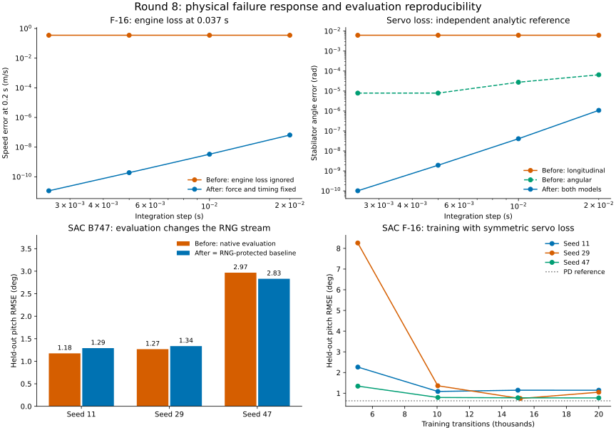

# Восьмой проход: отказы F-16 и воспроизводимость оценки SAC

Дата: 17 сентября 2026. Baseline — незакоммиченное состояние после седьмого
прохода, сохранённое в `/tmp/physics-policy-audit-round8/before`.
Предыдущие изменения сохранены; новые изменения не закоммичены.

## Результат

- Исправлена фактически отсутствовавшая реакция поступательной динамики F-16
  на отказ двигателя, время применения повреждений и отказы продольного привода.
- Исправлены сохранение конфигурации сред F-16, обработка начальных событий и
  временного конца продольного эпизода.
- Детерминированная оценка SAC больше не меняет поток случайных чисел обучения.
- **2846 тестов проходят**, покрытие **20957 / 22530 = 93,02%**. Добавлено 35
  тестовых случаев; все 35 падают на исходном снимке и проходят после исправлений.
- Выполнены **12 новых обучений по 20 000 переходов** и 6 дополнительных оценок
  сохранённых весов F-16 на двух версиях физики. В итоговых сценариях нарушений
  границ нет, но гарантии сходимости всех политик эти эксперименты не дают.

[Машиночитаемые результаты, кривые и хеши](physics-policy-validation-round8.json).

## Найденные и исправленные ошибки

### Физика и обработка событий F-16

1. **Отказ двигателя не уменьшал тягу в ODE.** Состояние `engine_failure`
   обновлялось, но сила оставалась прежней. Теперь при `track_altitude=True`
   `thrust_factor` и `hard_failure` влияют на ускорения скорости, угла атаки и
   скольжения. Проверка проекций силы выполняется независимо от интегратора.
2. **Повреждения применялись раньше времени.** Событие внутри шага меняло
   параметры до интегрирования всего шага, в том числе события на его правой
   границе. Теперь обе модели интегрируются отдельными интервалами до и после
   события. Последняя стадия RK4 перед событием использует старые параметры.
3. **События в нуле пропускались.** Теперь они применяются до наблюдения `reset()`.
4. **Порядок событий зависел от порядка списка и источника.** Профиль и
   `inject_event()` теперь объединяются по времени; повторное пересечение окна
   не применяет событие профиля второй раз. При одинаковом времени порядок
   стабилен: сначала элементы профиля, затем добавленные события.
5. **Продольная модель игнорировала отказы стабилизатора.** Теперь `jam`, `lost`
   и `efficiency_loss` изменяют команду её единственного канала. Эта сокращённая
   модель не описывает раздельные левую/правую поверхности и вызванный ими крен.
   Для такой задачи нужна угловая модель с `split_stab=True`.

Сохраняется одна запись состояния и управления за внешний шаг.
`damage_events_log`/`damage_state_log` используют фактическое время события;
`u_history` содержит эффективную команду на конце шага, а не её среднее за шаг.
Вспомогательное разделение интегрирования не увеличивает счётчик внешних шагов.

### Среды и сохранение

- `reset(options={"damage_profile": ...})` теперь работает и без профиля,
  переданного в конструктор. При следующем обычном сбросе используется
  конфигурация конструктора.
- Угловая среда получила `get_init_args()`. Профили обеих сред преобразуются
  в JSON-конфигурацию и восстанавливаются при загрузке SAC. Проверены наблюдения,
  действия загруженной политики и время срабатывания восстановленного события.
- `damage_event_callback` нельзя сохранить как переносимую конфигурацию;
  вместо его молчаливой потери выдаётся явная ошибка. Это сохранение настроек
  нового эпизода, не текущего повреждённого состояния самолёта.
- NaN/Inf в времени события, состоянии/шаге продольной модели и командах
  отклоняются. Неверная команда продольной среды не продвигает время и повреждения.
- Продольный лимит шагов теперь возвращает `terminated=False, truncated=True`.
  Replay SAC сохраняет возможность учитывать будущую ценность состояния.
  Такое различие обрезания траектории и терминального состояния описано в
  [документации Gymnasium](https://gymnasium.farama.org/tutorials/gymnasium_basics/handling_time_limits/).
  Два Python-примера обновлены для остановки по `terminated or truncated`.

### SAC

`select_action(..., evaluate=True)` и пакетный вариант вызывали `sample()`,
генерировали шум, а затем выбрасывали его. Поэтому одинаковые детерминированные
действия скрывали изменение RNG; вставка оценки между эпизодами меняла обучение.
У Deterministic-политики дополнительно изменялся буфер исследовательского шума.

Теперь среднее действие вычисляется напрямую, без генерации шума и графа
градиентов. Значение действия сохранено. Проверены Gaussian- и
Deterministic-политики, scalar/batch API и обучение с вставленными оценками.
Случайность самой оценочной среды должна изолироваться отдельно, если она
использует глобальные генераторы.

## Физические проверки

### Независимые эталоны

- Изменение производных скорости, угла атаки и скольжения при потере тяги
  проверено по проекциям добавленной силы `ΔT/m`, включая полную остановку двигателя.
- Для стабилизатора использовано аналитическое решение линейного сервопривода
  через матричную экспоненту. Команда 0,01 рад достаточно мала, чтобы не задеть
  ограничитель скорости привода; эталон не вызывает ODE модели привода.
- Полное состояние сравнивается с DOP853, интегрируемым отдельно между событиями
  (`rtol=1e-12`, `atol=1e-13`). В эталоне потеря тяги применяется отдельно от
  проверяемого подключения повреждений к ODE, чтобы общая ошибка не скрылась.

Девять сценариев: исправный аппарат, потеря эффективности стабилизатора в
0,037 с, потеря привода при `reset`, восстановление эффективности в 0,113 с —
для угловой и продольной моделей; отдельно отказ двигателя угловой модели.
Горизонт **0,2 с**, шаги **0,02 / 0,01 / 0,005 / 0,0025 с**.

При шаге 0,02 с:

| Проверка | До | После |
|---|---:|---:|
| Ошибка скорости после отказа двигателя | 0,350216 м/с | 6,56e−8 м/с |
| Ошибка угла стабилизатора, угловая модель, отказ в 0,037 с | 6,48e−5 рад | 1,08e−6 рад |
| То же, продольная модель | 6,18e−3 рад | 1,08e−6 рад |

После исправления ошибки уменьшаются с шагом в соответствии с RK4; до него
уменьшение шага не устраняло отсутствие реакции двигателя и продольного привода.
Исправные траектории в новом стенде **точно совпадают** до и после изменений.

Повторены пять прежних наборов: общие физические проверки самолётов и квадрокоптера,
транспортные самолёты, X-15, время отказов роторов и здоровый F-16.
Их JSON с результатами **полностью совпадают с седьмым проходом**. В частности,
сохранены проверки балансировки F-16, силовых балансов, переходных процессов,
исчерпания топлива ракеты и времён повреждений роторов.

Это проверка математической и численной согласованности симулятора.
Она **не заменяет калибровку аэродинамики и повреждений по лётным данным**.

## SAC на B747: влияние оценки на обучение

Девять запусков: seed **11, 29, 47** × три режима — старый SAC с внешним
сохранением RNG оценки, старый SAC с обычной оценкой, исправленный SAC с обычной
оценкой. Во всех случаях ровно **20 000 переходов**, одинаковый исходник среды,
сети 64×64, batch=128, replay=50000, gamma=0,99, tau=0,005, LR=0,0003,
alpha=0,01 без автонастройки энтропии, интервал target-обновления 1.

Контрольные эпизоды: 24 фиксированные ступени ±2°/±4°, включение через
0,5–1,5 с, горизонт 10 с, шаг 0,05 с. Нарушение — тангаж вне ±20°.
Оценка вставляется примерно через каждые 5000 переходов на границе эпизода.

| Seed | До, обычная оценка | После | Нарушения после |
|---|---:|---:|---:|
| 11 | 1,1757° | 1,2916° | 0/24 |
| 29 | 1,2688° | 1,3372° | 0/24 |
| 47 | 2,9679° | 2,8319° | 0/24 |
| Среднее | **1,8041°** | **1,8202°** | **0/72** |

**Все три сети — policy, critic и critic_target — исправленных запусков побитно
совпали с контрольными запусками, где RNG сохранялся внешним кодом.** Оценки
этих пар также совпали. Вызов новой оценки не меняет RNG ни на одной контрольной
точке; старый вариант менял его на каждой.

Средняя RMSE относительно старого обычного запуска немного выросла:
**+0,0161°**, около **0,89%**. У seed 11/29 ошибка выросла, у seed 47 уменьшилась.
Исправление устраняет побочный эффект измерения и не является универсальным
улучшением политики. PD даёт около **0,9538°**, нулевое управление — **2,8493°**;
seed 47 остаётся слабым. Все потери каждого обновления и конечные веса конечны.

## Новые политики F-16 на исправленной физике

Три новых запуска SAC по **20 000 переходов**, seed **11, 29, 47**.
Угловая 16-компонентная модель, симметричное управление раздельным стабилизатором,
балансировка **120 м/с, 3000 м**, шаг 0,02 с, горизонт 3 с. Тяга постоянна на
балансировочном значении. Действие политики — поправка ±4° к стабилизатору.

Обучение включает исправную систему и одинаковую потерю эффективности обеих
половин стабилизатора до 0,6–0,95. Ступени тангажа — ±2,5°, время включения
0,3–0,8 с, повреждение — 0,6–1,4 с. Наблюдения включают **истинную эффективность
из симулятора**: это не проверка диагностики отказов по датчикам.

SAC: сети 64×64, batch=128, gamma=0,99, tau=0,005, LR=0,0003, alpha=0,01,
без автонастройки энтропии. Награда штрафует ошибку тангажа, угловую скорость
и управляющее действие; оценка сохраняет RNG обучения.

Оценка — 12 сочетаний ступеней ±1°/±2° с исправным приводом, эффективностью
0,75 после 1,015 с и 0,6 после 0,515 с. Итоговые веса дополнительно проверены
на предыдущей версии физики; повторное обучение для этой колонки не выполнялось.

| Seed | Те же веса, прежняя физика | Исправленная физика | Нарушения после |
|---|---:|---:|---:|
| 11 | 1,1536° | 1,1437° | 0/12 |
| 29 | 1,0514° | 1,0488° | 0/12 |
| 47 | 0,7793° | 0,7716° | 0/12 |
| Среднее | **0,9948°** | **0,9880°** | **0/36** |

Контрольный PD с доступом к той же эффективности даёт **0,6324°**,
фиксированная балансировочная команда — **3,3246°**. Все три SAC лучше
фиксированной команды, но уступают PD. Оцениваются последние веса, без выбора
лучшего checkpoint.

Границы нарушения: отклонение тангажа от балансировки >20°, угол атаки >35°
по модулю, крен >30° по модулю или скорость вне 60–200 м/с.
В итоговых сценариях скорость **119,254–120,759 м/с**, максимальное отклонение
тангажа **3,791°**; параметры и потери конечны. У seed 29 после примерно 5000
переходов было **2/12 нарушений**, затем они исчезли. Кривые немонотонны.
Утверждение о гарантированной сходимости или безопасности во время обучения
из этих результатов не следует.

Повторная оценка checkpoint на окончательной версии исходников точно совпала
с финальной оценкой каждого обучения. Эти опыты проверяют частичные симметричные
отказы стабилизатора; обучение политики для отказа двигателя не выполнялось.



## Ограничения и проверки

- Не проверены весь конверт полёта, асимметричные разрушения, диагностика,
  длительные аварийные режимы и неопределённость аэродинамики.
- Модель повреждений по-прежнему содержит упрощения геометрии и мгновенного
  изменения параметров. Восстановление по `DamageEvent.duration` и детальная
  механика ударов/отделения частей в этом проходе не валидировались.
- Сокращённые модели с заданной постоянной скоростью не могут описывать потерю
  скорости при отказе двигателя. Сохранение конфигурации среды не является
  сохранением текущего полётного состояния, replay buffer или RNG.
- Другие алгоритмы проверены общим набором регрессий; все семейства агентов
  заново не обучались. Результаты предыдущих проходов сохранены отдельно.
- **2846 passed**, 14 предупреждений; `tests/optimization/ray_test.py` исключён,
  как в предыдущих проходах. Покрытие **93,02%**, порог 92% пройден.
- Flake8 **30≤30**, Ruff **0**, mypy **0**, Bandit **82≤114**, medium **59≤83**,
  high **0**. Baseline не ослаблялся. Black, isort, `git diff --check`, проверка
  синтаксиса обновлённых примеров и строгая сборка MkDocs проходят.

## Воспроизведение

Новые скрипты:

```bash
.venv/bin/python scripts/validate_f16_damage.py \
  --repo . --output /tmp/f16-damage.json

OMP_NUM_THREADS=1 MKL_NUM_THREADS=1 WANDB_MODE=disabled \
.venv/bin/python scripts/validate_sac_evaluation.py \
  --repo . --env-source tensoraerospace/envs/b747_vec_torch.py \
  --seed 11 --frames 20000 --output /tmp/sac-evaluation-11.json

OMP_NUM_THREADS=1 MKL_NUM_THREADS=1 WANDB_MODE=disabled \
.venv/bin/python scripts/validate_f16_policy.py \
  --repo . --seed 11 --frames 20000 --output /tmp/f16-policy-11.json
```

Повторить обучения для seed 29 и 47. Для старой реализации задать
`--repo /tmp/physics-policy-audit-round8/before`, сохранив тот же исходник среды
B747. Контроль оценки SAC — `--preserve-rng`. Для оценки фиксированных весов F-16
использовать `--checkpoint /path/to/f16-policy-11.pt`.

Логи, checkpoint, JUnit и физические эталоны лежат в
`/tmp/physics-policy-audit-round8/`. JSON отчёта содержит все численные результаты
и хеши артефактов/исходников. Исходники прежних проверочных скриптов не заменялись.
