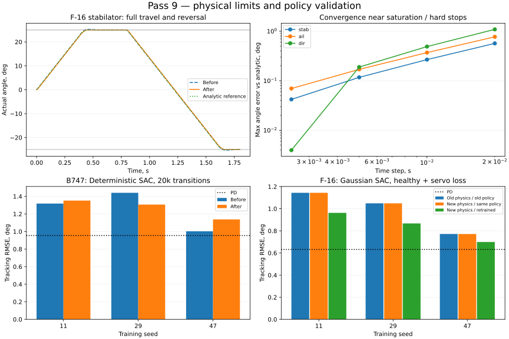

# Девятый проход: ограничения приводов и исследовательский шум SAC

Дата: 17 сентября 2026. Ветка `fix/agent-runtime-bugs`.
Baseline — незакоммиченное состояние после восьмого прохода, снимок
`/tmp/physics-policy-audit-round9/before`. Все прежние изменения сохранены.
Новые изменения не закоммичены.

## Результат

- Исправлены физические ограничения приводов F-16, обход ограничений раздельным
  стабилизатором и чрезмерной командой при потере эффективности.
- Диапазоны действий угловой среды соответствуют отдельным поверхностям.
- Шум Deterministic SAC независим по batch, масштабируется в единицах действия
  и не выводит результат за точные границы пространства действий.
- **2881 тест проходит**, покрытие **20987 /
  22560 = 93.03%**.
  Добавлено 35 случаев: 29 выявляют ошибки baseline, ещё 6 проверяют сохранённое
  поведение. Все 35 проходят после исправлений.
- Выполнены 9 основных обучений по 20 000 переходов: 6 сравнений Deterministic
  SAC и 3 обучения на F-16. Дополнительно — один контроль Gaussian SAC и повтор
  первого Deterministic запуска на окончательном коде: всего **11 запусков обучения**.
- Итоговые политики не нарушают заданных границ в контрольных эпизодах. При
  обучении F-16 были нарушения в промежуточной оценке; гарантии сходимости нет.

[Метрики, кривые и хеши](physics-policy-validation-round9.json).



## Исправленные ошибки

### Агент

`DeterministicPolicy.sample()` использовал один шумовой вектор для всего batch,
прибавлял его непосредственно в физических единицах и не ограничивал итоговое
действие. Результат мог выходить за границы, а replay и critic получали действие,
которое среда затем отсекала. Для тяги в ньютонах шум 0,1 был почти незаметным,
для узкого диапазона углов — чрезмерным.

Теперь шум генерируется независимо для каждой строки и компоненты:
`clip(N(0, 0.1), -0.25, 0.25) * action_scale`, итог ограничивается границами Box.
В узком смещённом диапазоне `[2, 2.01]` восстановление границ через bias ± scale
давало ошибку округления float32; используются сохранённые точные границы.
Ограничено и детерминированное среднее. Буфер `noise` оставлен в state_dict для
загрузки старых весов, новые границы — непостоянные буферы из конфигурации среды.
Новая последовательность случайных чисел закономерно меняет обучение.

### Объект и среда

Ранее ограничивалась команда и производная угла, но состояние скорости привода
накапливалось выше допустимого, а фактический угол пересекал механический упор.
Теперь внутри ограничений используется прежнее уравнение второго порядка; на
ограничении скорости убирается ускорение наружу, на упоре — движение наружу.
Принятое состояние проецируется на допустимые угол и скорость. Реверс остаётся
доступным. Аэродинамика промежуточных стадий не получает углы за упорами.

Ограничение положения и скорости — отдельные эффекты модели привода; такое
разделение также описано в [документации JSBSim](https://jsbsim-team.github.io/jsbsim/classJSBSim_1_1FGActuator.html).
Это ссылка на принцип моделирования, а не калибровка параметров F-16.

Команды ограничиваются до потери эффективности и после подстановки заклинивания.
В `split_stab=True` ограничивается каждая половина до вычисления среднего и
разности. Раньше команда `[250°, -250°]` создавала в десять раз больший момент,
чем `[25°, -25°]`, при одинаковом среднем угле.

`NonlinearAngularF16.action_space`: стабилизатор ±25°, элерон ±21,5°, руль
направления ±30°; тяга `[0, 130000]` Н. Раньше все поверхности имели ±25°:
часть элеронных действий не исполнялась, а часть диапазона руля была недоступна.
`u_history` теперь содержит ограниченную эффективную команду, `x_history` —
фактическое состояние привода. Счётчики и формат состояний сохранены.

## Проверка физики

Сценарий: из нуля полная положительная команда 0,8 с, затем отрицательная 1 с.
Угловая модель проверена отдельно для трёх поверхностей; продольная — для
стабилизатора. Шаги RK4: 0,02 / 0,01 / 0,005 / 0,0025 с. Регрессионные тесты
также проверяют Euler, оба знака команд и возможность реверса.

Независимый эталон использует аналитическое решение колебательного звена между
событиями, постоянную скорость при насыщении и остановку на упоре. Моменты
пересечения ограничений находятся Brent-методом. Эталон не вызывает функции
привода из production-кода; его значения на общих временных точках совпадают
для всех четырёх шагов с точностью 2e−11.

Максимумы при dt=0,01 с, включая реверс:

| Поверхность | Угол до → после, ° | Состояние скорости до → после, °/с |
|---|---:|---:|
| stab | 25.265 → 25.000 | 1069.94 → 60.00 |
| ail | 21.738 → 21.500 | 1377.55 → 80.00 |
| dir | 30.527 → 30.000 | 1226.44 → 120.00 |

Все новые траектории соблюдают также `abs(Δугол) ≤ dt * max_rate` с машинной
погрешностью. Старые большие значения скорости — скрытое состояние привода,
а не фактически достигавшаяся скорость изменения поверхности.

**Ограничение точности:** возле переключений насыщения RK4 не имеет четвёртого
порядка. Максимальная ошибка угла стабилизатора против аналитики при указанных
шагах: 0,5670 / 0,2670 / 0,1170 / 0,0420°. При dt=0,01 старая ошибка угла была
0,2652°: исправление ограничений не улучшает каждую численную метрику на грубом
шаге. Ошибка состояния скорости резко снизилась; на самом упоре скорость
разрывна, поэтому её максимальная поточечная ошибка чувствительна к сетке.
Метрики остальных поверхностей и интегральная ошибка скорости сохранены в JSON.

Малая команда 0,001 рад совпадает с независимой матричной экспонентой с допуском
3e−9 для угла и скорости при dt=0,001 с. Повторные проверки четырёх режимов
балансировки, переходных процессов RK4/DOP853, силы двигателя и времени отказов
**точно совпадают с восьмым проходом**. Это проверка согласованности математики
и численного решения, не валидация по лётным данным.

## Обучение и качество политик

### B747: Deterministic SAC

Три seed, одинаковая физика из baseline, ровно 20 000 переходов на запуск.
Сеть 64×64, batch 128, replay 50000, LR 0,0003, gamma 0,99, tau 0,005,
`policy_type="Deterministic"` (alpha=0). Действие нормализовано в `[-1, 1]`.
Оценка: 24 фиксированных ступени ±2°/±4°, старт 0,5–1,5 с, горизонт 10 с,
dt=0,05 с. Нарушение: тангаж вне ±20°. Потери проверялись после каждого обновления.

| Seed | RMSE до, ° | RMSE после, ° | Итоговые нарушения после |
|---|---:|---:|---:|
| 11 | 1.3184 | 1.3521 | 0 / 24 |
| 29 | 1.4406 | 1.3066 | 0 / 24 |
| 47 | 1.0024 | 1.1381 | 0 / 24 |

Среднее **1.253793 → 1.265581°**, изменение
**+0.94%**. Средняя ошибка немного выросла;
устранение дефектов семплирования не гарантирует прироста награды. В обоих
режимах 0/72 итоговых нарушений. PD: **0.953801°**,
лучше каждой итоговой SAC-политики в этой серии. Потери и веса конечны.

Контроль Gaussian SAC, seed 11: веса policy/critic/target, RMSE и хеш исходника
среды точно совпадают с восьмым проходом. Первый Deterministic запуск повторён
после уточнения границ float32; веса и итоговые метрики тоже совпадают точно.

### F-16: сохранённые веса и переобучение

Сначала три checkpoint предыдущего прохода оценены на исправленной физике.
Затем обучены три Gaussian SAC с теми же seed и бюджетом 20 000 переходов.
Сценарии и гиперпараметры сохранены: 120 м/с, 3000 м, dt=0,02 с, 3-секундные
эпизоды; симметричный стабилизатор в пределах балансировки ±4°, постоянная
балансировочная тяга. 12 оценок на seed: ступени ±1°/±2° × исправный привод и
потеря эффективности до 0,75 либо 0,6 внутри шага. Истинная эффективность входит
в наблюдение; это не проверка диагностики отказов.

| Seed | Старые физика и веса, ° | Новая физика, те же веса, ° | Новая физика, переобучение, ° |
|---|---:|---:|---:|
| 11 | 1.143654 | 1.143654 | 0.962521 |
| 29 | 1.048822 | 1.048833 | 0.867070 |
| 47 | 0.771632 | 0.771357 | 0.698929 |

Среднее: **0.988036 → 0.987948°** для неизменённых весов;
после переобучения **0.842840°**. Итоговые нарушения: **0/36** и для
сохранённых, и для заново обученных политик. Контролируются конечность состояния,
отклонение тангажа ±20°, атака ±35°, крен ±30°, скорость 60–200 м/с.
Все конечные веса и потери обновлений конечны.

PD с той же информацией об эффективности: **0.632450°**,
по-прежнему точнее SAC. При seed 29 около 5129 переходов RMSE достигала
8,2814° и было **5/12 нарушений**; на последующих оценках нарушения исчезли.
Улучшение финальных результатов не является доказательством монотонного или
безопасного обучения.

## Проверки качества и воспроизведение

- Pytest: 2881 passed, 14 warnings; исключён прежний
  `tests/optimization/ray_test.py`. Покрытие 93.03%.
- Flake8: 30 замечаний при baseline ≤30; Ruff: 0; mypy: 0.
- Bandit: 82 при baseline ≤114; medium 59≤83, high 0.
- Black/isort проверили 11 Python-файлов текущего прохода; `git diff --check` чист.
- `mkdocs build --strict` прошёл. Пороги CI не изменены.

Стенды:

```sh
.venv/bin/python scripts/validate_f16_servos.py --repo "$PWD" --output /tmp/servos.json
.venv/bin/python scripts/validate_sac_exploration.py --repo "$PWD" --env-source tensoraerospace/envs/b747_vec_torch.py --seed 11 --frames 20000 --output /tmp/sac.json
.venv/bin/python scripts/validate_f16_policy.py --repo "$PWD" --seed 11 --frames 20000 --output /tmp/f16.json
```

Запуски использовали CPU и `OMP_NUM_THREADS=1 MKL_NUM_THREADS=1`,
`PYTHONDONTWRITEBYTECODE=1 MPLBACKEND=Agg WANDB_MODE=disabled`.
Полные логи, траектории и checkpoint — `/tmp/physics-policy-audit-round9`;
они временные. В отчёте JSON сохранены численные результаты и хеши исходников
и артефактов; SVG — переносимый график.

## Границы результата

Проверены указанные модели, режимы и seed, а не вся область полёта и все агенты.
Дифференциальный момент стабилизатора пока моделируется мгновенно: независимые
левый/правый приводы отсутствуют. Изменение диапазонов элерона и руля требует
отдельной оценки старых многоканальных политик; приведённый тест F-16 управляет
симметричным стабилизатором. Асимметричные повреждения, отказ двигателя в обучении,
реальные датчики, диагностика, аэродинамика за пределами таблиц и лётная
калибровка этим проходом не подтверждены.
