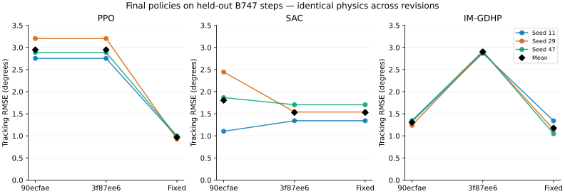

# Проверка физики и обучения — 16 сентября 2026

Следующий этап: [третий проход — A2C, GAIL и AAI Shadow](physics-policy-validation-round3.md). Метрики ниже описывают историческое состояние; временные артефакты первых двух проходов сейчас недоступны, численные результаты сохранены в JSON.

> Отчёт первого прохода. [Продолжение: X8, NARX A2C и GAIL, включая ограничения качества](physics-policy-validation-round2.md). Описанная ниже продольная балансировка X8 исправлена во втором проходе.

## Результат

Исправлены подтверждённые ошибки PPO, IM-GDHP, A3C, физического ограничителя B747 и сил/балансировки нелинейного F-16. **2607 тестов проходят**, покрытие строк **92,80%**. Добавлен **31 регрессионный случай**.

Основное сравнение содержит **27 обучений**: три алгоритма × три seed × три версии. На общей физике B747 у итоговых политик не было NaN/Inf в проверяемых обновлениях, весах и действиях, а в контрольных эпизодах — выходов за предел тангажа ±20°. Это экспериментальная проверка конкретных режимов, а не доказательство устойчивости при любых условиях.

## Сравнение политик

Значения — среднее по seed `11, 29, 47` от средней по эпизодам RMSE тангажа в градусах. Меньше — лучше. Оценивается финальная политика, без отбора лучшего seed или checkpoint.

| Алгоритм | Исходная `90ecfae` | До этого прохода `3f87ee6` | После исправлений |
|---|---:|---:|---:|
| PPO | 2,9466° | 2,9466° | **0,9673°** |
| SAC | 1,8041° | 1,5281° | **1,5281°** |
| IM-GDHP | 1,3029° | 2,8978° | **1,1767°** |



Для PPO/SAC используются 24 фиксированных контрольных эпизода на seed: ступени −4°, −2°, +2°, +4° с различным моментом включения. Для IM-GDHP — четыре эпизода со ступенями ±1°, ±2° и меньшим пределом управления. **Строки таблицы служат сравнению версий одного алгоритма; напрямую ранжировать алгоритмы по ним нельзя.**

- PPO: 163 840 взаимодействий со средой на запуск; 40 сборов по 256 векторных шагов, 16 сред, четыре эпохи, batch 512, сети 64×64, actor LR 0,0003, critic LR 0,001, `target_kl=0.03`, без нормализации наблюдений и наград.
- SAC: 96 000 взаимодействий на запуск; 6000 векторных шагов, 16 сред, 250 начальных шагов исследования, 5750 обновлений, batch 128, сети 64×64, `alpha=0.01` без автонастройки.
- IM-GDHP: 3980 взаимодействий на запуск; 20 эпизодов по 199 шагов, сети 16×16 и 32×32, масштабы наблюдений `(1,1,10,10)`, `gamma=0.95`, actor LR 0,0001, critic LR 0,001, `u_max=0.04` в нормализованных единицах B747. Остальные настройки сохранены в исходных JSON.
- Во всех версиях используется один и тот же исходный файл исправленной `ImprovedB747VecEnvTorch`, CPU, `dt=0.05`, горизонт 10 с, награда `tracking`. Это отделяет изменения агента от изменения модели объекта. Политики до исправлений также обучались на этой общей физике.
- Финальные контрольные прогоны: PPO — 72 эпизода, SAC — 72, IM-GDHP — 12. Выходов за предел тангажа нет во всех трёх версиях; улучшение видно по точности слежения.

Проверка не подтверждает улучшение каждого seed относительно исходной `90ecfae`: у SAC seed 11 стал хуже (1,103° → 1,342°), у IM-GDHP seed 11 — немного хуже (1,325° → 1,340°). Три seed недостаточны для вывода о статистически доказанном превосходстве. Относительно непосредственно предыдущей `3f87ee6` PPO и IM-GDHP улучшились на каждом из трёх seed, SAC воспроизвёл прежний результат.

### Что выявило реальное обучение

**PPO:** старое начало диапазона дисперсии давало стандартное отклонение около `exp(-10) ≈ 0.000045`. В сохранённых выборках KL после обновлений достигал тысяч, и ограничитель KL обрывал эпохи. Новая инициализация начинает около `exp(-0.5) ≈ 0.607`, сохраняя имена параметров и преобразование выходов для старых весов. Все 1280 запланированных minibatch-обновлений выполнены; KL в сохранённых выборках меньше 0,02. Дополнительно исправлены bootstrap на ограничениях времени, нормализация векторных наблюдений, сохранение наблюдений из переиспользуемых буферов и NaN при единственном переходе. Непосредственная награда auxiliary head не смешивается с оценкой будущей стоимости. Разделение termination/truncation соответствует [контракту Gymnasium](https://gymnasium.farama.org/tutorials/gymnasium_basics/handling_time_limits/).

**IM-GDHP:** промежуточная версия ухудшала управление, хотя веса оставались конечными. Актор игнорировал обучаемую голову costate `λ` и дифференцировал независимую голову `J`. Теперь вклад будущей стоимости в градиент управления равен `gamma * B.T @ lambda_next` в физических координатах. Значение `J` остаётся в отчёте о стоимости. Аналитический тест проверяет знак и величину градиента при масштабах 0,1; 1; 10. Связь стоимости и её производной важна для GDHP; независимость двух оценок нельзя игнорировать при обновлении управления. См. [работу о согласованном dual network для GDHP](https://pure.tudelft.nl/ws/portalfiles/portal/170414079/Efficient_Online_Globalized_Dual_Heuristic_Programming_With_an_Associated_Dual_Network.pdf).

Диагностика IM-GDHP сохранена: увеличение начальной ковариации RLS до 10⁶ не устранило ухудшение; отключение будущей стоимости при `gamma=0` остановило сильный дрейф, но не дало качественного слежения. Исправление градиента проверено с исходными настройками, без такой подмены алгоритма.

**A3C:** отдельный тест рабочего процесса подтвердил обнуление bootstrap при лимите среды и лимите `MAX_EP_STEP`. Исправлен терминальный признак для `push_and_pull`, окончание эпизода сохранено. Длительное сравнительное обучение A3C в эту серию не входит.

## Физика

### F-16: ошибка преобразования сил и ложная балансировка

`Cx` использовался как сопротивление вдоль скорости; также были неверны знаки осевой силы в проекциях на направления изменения угла атаки и скольжения. В режиме с высотой и скоростью тяга влияла только на скорость.

Теперь связанная сила NED `[T-q*S*Cx, q*S*Cz, -q*S*Cy]` проецируется на направление скорости; тяга входит и в поперечные проекции. Независимый тест восстанавливает декартово ускорение из `dV`, `dalpha`, `dbeta` и сравнивает его со вторым законом Ньютона, включая тяжесть и вращение связанных осей. Необходимость различать связанные и скоростные оси поясняет [NASA](https://www.grc.nasa.gov/www/k-12/airplane/tunbalaxes.html).

Балансировка совместно решает угол атаки, стабилизатор и тягу. `converged=True` теперь требует всех трёх малых остатков и допустимых ограничений. Искусственный минимум тяги 8000 Н убран. Параметры переданного объекта не меняются в процессе поиска.

| Режим F-16 | Старый дрейф скорости за 5 с | Новый дрейф скорости за 5 с |
|---|---:|---:|
| 100 м/с, 1000 м | +6,486 м/с | +1,06×10⁻⁷ м/с |
| 120 м/с, 3000 м | +5,661 м/с | +8,56×10⁻⁸ м/с |
| 160 м/с, 5000 м | +3,376 м/с | +1,72×10⁻⁷ м/с |

Новый дрейф высоты меньше 2,3×10⁻⁶ м. Дрейф старой версии совпадает у `90ecfae` и `3f87ee6`: это существовавший ранее дефект. Устаревший snapshot траектории заменён сравнением RK4 с независимым DOP853 на участках постоянной команды. Старые траектории и политики F-16 требуют повторной оценки после изменения уравнений; таблица обучения выше относится к B747.

### B747: одинаковые ограничения приводов

Векторная среда ограничивала скорость руля как 60 рад/с, а скалярная модель — как 60°/с. Первый шаг скалярной модели вообще обходил ограничение скорости. Обе реализации теперь используют 60°/с и начальное нейтральное положение. При `dt=0.01` первое отклонение не превышает 0,6°, а не 25°. Проверены совпадение траекторий и ограничения при насыщении/реверсе команды для `dt=0.01`, `0.05`, `0.1`.

### Квадрокоптер

- Производная полной энергии совпадает с мощностью тяги, моментов и диссипации на 100 состояниях: максимальный остаток **1,78×10⁻¹⁵ Вт**.
- При нулевой скорости и углах тяга `m*g` даёт нулевую производную состояния.
- Ошибка RK4 относительно DOP853 на 2 с: **4,40×10⁻⁷ → 2,74×10⁻⁸ → 1,71×10⁻⁹** при шагах **0,08 → 0,04 → 0,02 с**. Уменьшение примерно в 16 раз соответствует четвёртому порядку.

### Другие самолёты и ограничения

Дополнительно проверены по три скорости для B747, B737, Skywalker X8 и AAI Shadow с удержанием найденной команды 5 с. Полные успешные балансировки B747/B737/Shadow сохраняют скорость и высоту с численной точностью. Все эти результаты до и после изменений совпадают в пределах численной точности.

Остались ограничения, которые нельзя засчитать как полноценное равновесие:

- **Skywalker X8:** его существующая процедура `trim` решает только продольные уравнения. На 18 м/с и 178 м продольный остаток мал, но за 5 с полный объект изменяет высоту примерно на **2,39 м**. Для равновесия всех шести степеней свободы нужен отдельный расчёт бокового состояния и управления. Это поведение присутствует и в обеих исходных версиях.
- **B747:** на 30 000 ft точки 750 и 787,5 ft/s не дали сошедшейся балансировки; 712,5 ft/s сошлась. Нельзя использовать несошедшиеся результаты как начальный установившийся полёт.
- **AAI Shadow:** на высоте 1000 м точки 34,2 и 36 м/с сошлись, 37,8 м/с — нет.

Проверки подтверждают внутреннюю физическую согласованность перечисленных режимов. Они не заменяют сравнение коэффициентов с лётными данными и не охватывают весь диапазон высот, скоростей, повреждений и углов. Длительное обучение остальных агентов, шумы датчиков, перенос политик на нелинейные модели и восстановление после отказов требуют отдельных экспериментов.

## Воспроизведение

Скрипты: [физика](../scripts/validate_physics.py), [PPO/SAC](../scripts/validate_policies.py), [IM-GDHP](../scripts/validate_adp.py). Сводные числа, параметры режимов и результаты по seed: [JSON](physics-policy-validation.json).

Снимки исходных версий были извлечены через `git archive` в отдельные каталоги; основной checkout не переключался. Пример запуска из корня проекта для одной версии:

```bash
python scripts/validate_physics.py --repo . --output /tmp/physics-current.json
python scripts/validate_policies.py --repo . --env-source tensoraerospace/envs/b747_vec_torch.py --algorithm ppo --seed 11 --output /tmp/ppo-current-11.json
python scripts/validate_policies.py --repo . --env-source tensoraerospace/envs/b747_vec_torch.py --algorithm sac --seed 11 --output /tmp/sac-current-11.json
python scripts/validate_adp.py --repo . --env-source tensoraerospace/envs/b747_vec_torch.py --seed 11 --output /tmp/imgdhp-current-11.json
```

Для исторической версии изменяется `--repo`; `--env-source` остаётся абсолютным путём к общей исправленной среде. Повторить для seed 11, 29, 47. Эксперименты выполнены с `OMP_NUM_THREADS=1`, `MKL_NUM_THREADS=1`, `WANDB_MODE=disabled`, на CPU: Python 3.11.10, NumPy 1.26.4, SciPy 1.15.3, PyTorch 2.14.0+cu130. Это фактически использованное окружение, а не утверждение о прогоне каждой поддерживаемой версии зависимостей.

## Проверки кода

- **2607 passed**, 14 предупреждений, 105,84 с; опциональный `tests/optimization/ray_test.py` исключён, как и в предыдущем прогоне.
- Покрытие: **20 480 / 22 068 строк = 92,80%**.
- Flake8: 29 при baseline ≤30; Ruff: 0; mypy: 0.
- Bandit: 82 при baseline ≤114; medium 59≤83, high 0.
- Строгая сборка MkDocs прошла; Black, isort и `git diff --check` пройдены.
- Полные логи, неудачные воспроизведения, промежуточные эксперименты и обученные веса PPO/SAC находятся в `/tmp/physics-policy-audit/`. Диагностические исходные результаты сохранены, а не заменены итоговыми удачными прогонами.
